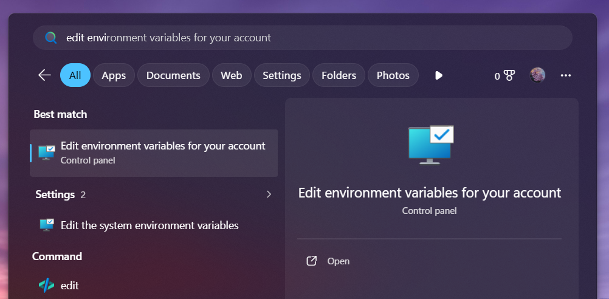
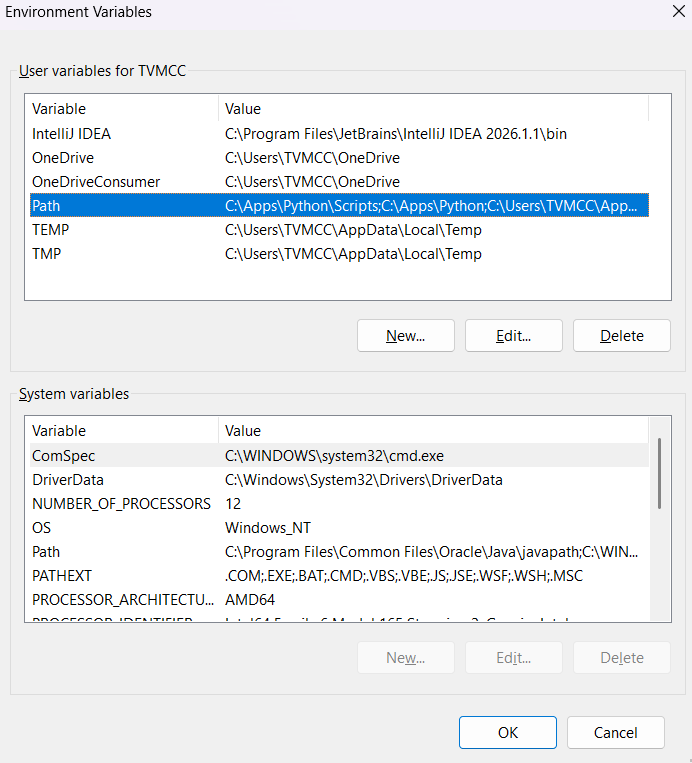
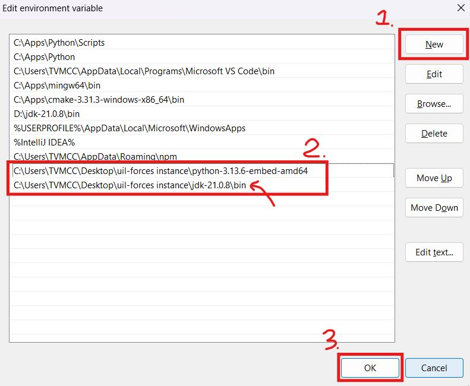

## Running the Server

To start the UIL Forces server, run the executable file provided, either by simply double-clicking it or running it through a console window.

## Database Setup

Setup only needs to be done once for each instance of UIL Forces. It is done to initialize the database with all of the problem sets, PDFs, and data files.

Before setup, make sure to add a secret key (any form of text) in a file called `secret.txt` located in the root directory. This directory will also contain the database file which will be created after going through the following steps.

After running the UIL Forces server, select action 2: "Start server setup". This will scan the working directory for a folder named `setup` with a file structure as specified in [Setup Folder Structure](#setup-folder-structure)

Once setup is complete, you will not have to mess with problem sets unless new problems need to be added. This can be done either through the admin panel, or by editing the setup folder and config file to add the new problem set. If new problem sets are added to the setup folder, rerun the "Start server setup" action and the interface will allow the new problem sets to merge into the current database.

## Judge System Setup

Use action 3: "Check required tools" to make sure that the proper toolchains are installed for the languages you wish to support. These tools must be added to the PATH environment variable in order to work. Here is how to do that:

### Downloading the Toolchains

First, download the toolchains if you do not have them already. If running UIL Forces on a school computer with heavy restrictions, you may need to download these on a non-school computer and bring them over via an external drive:

- Python: https://www.python.org/ftp/python/3.14.6/python-3.14.6-embed-amd64.zip 
  - If downloading a different version, make sure it is the **Windows embeddable package (64-bit)**
- Java: https://download.oracle.com/java/21/latest/jdk-21_windows-x64_bin.zip 
  - If downloading a different version, make sure it is the **x64 Compressed Archive**

Place the extracted zip archives in a memorable location, or in the same directory where UIL Forces lives.

### Adding toolchains to the PATH environment variable (Windows)

Type "Edit environment variables for your account" into the Windows search bar:

Open the control panel menu labeled "Edit environment variables for your account". Then double-click on the variable named "Path"

Click the new button and add the paths to your toolchains.
- Python Path: `<absolute path to python toolchain>`
- Java Path: `<absolute path to jdk>/bin` (don't forget the /bin at the end)

Once you are done, click "Ok"

### Judge System Testing

After setting up the toolchains, run action 3: "Check required tools", to make sure that the judge system can access the Java and Python toolchains.

If those succeed, then run action 4: "Judge self-test". This will try submitting code to the judge system to make sure that setup is complete.

## Usage

After a database has been initialized with problem sets and an admin user, most usage will involve creating contests through the admin panel and adding problem sets (which can be from different problem sets).

## Setup Folder Structure

This is how the setup folder should be set up so that UIL Forces can read it correctly:

- `pdfs`: A directory containing the PDFs (programming packets) that each problem set will reference.
- `psets`: A directory containing the input and output data for each problem set. As shown in the picture below, each problem set has its own directory. At the root of this directory is the judge data and in the nested `student_data` directory is the student data. The data file names in `student_data` should be the same as their judge data counterparts.  

- `setup.yaml`: This is the configuration file used to match PDFs and data files to their respective problem sets and initialize settings and users. It is mainly used to make an admin user since at least one admin user must be created at setup in order to access the admin panel (from which you can create more users with or without admin privileges if needed).
  - Data files will automatically be detected based on UIL's usual convention that the data file names are the lowercased version of the problem name. For exceptions to this rule, use the YAML keys `input_data_file` and `output_data_file` to specify actual data file names.
  - The `pages` YAML key specifies which page numbers (space separated) of the problem set PDF should be loaded when the problem is selected on the submission page.

An example of a valid setup directory can be found in `backend/setup-example`. Note that this folder must be renamed to `setup` and be placed in the same directory as the project executable file.