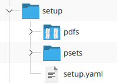
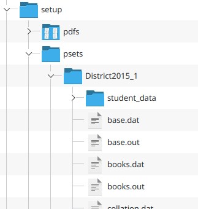

## Setup

Setup only needs to be done once for each instance of UIL Forces. It is done to initialize the database with all of the problem sets, PDFs, and data files.

Before setup, make sure to add a secret key (any form of text) in a file called `secret.txt` located in the root directory. This directory will also contain the database file which will be created after going through the following steps.

After running the project, select action 2: "Start server setup". This will scan the working directory for a folder named `setup` with a file structure as depicted below:

- `pdfs`: A directory containing the PDFs (programming packets) that each problem set will reference.
- `psets`: A directory containing the input and output data for each problem set. As shown in the picture below, each problem set has its own directory. At the root of this directory is the judge data and in the nested `student_data` directory is the student data. The data file names in `student_data` should be the same as their judge data counterparts.  

- `setup.yaml`: This is the configuration file used to match PDFs and data files to their respective problem sets and preinitialize basic settings and users. It is also mainly used to make an admin user since at least one admin user must be created at setup in order to access the admin panel (from which you can create more users with or without admin privileges if needed).
  - Data files will automatically be detected based on UIL's usual convention that the data file names are the lowercased version of the problem name. For exceptions to this, use the YAML keys `input_data_file` and `output_data_file` to specify actual data file names.
  - The `pages` YAML key specifies which page numbers (space separated) of the problem set PDF should be loaded when the problem is selected on the submission page.

An example of a valid setup directory can be found in `example-setup-dir`. Note that this directory must be named to `setup` and be placed in the same directory as the project executable file.

## Usage

Once setup is complete, you will not have to mess with problem sets for the most part. Most usage will involve creating contests through the admin panel by setting a time frame and adding problems (which can be from different problem sets).
