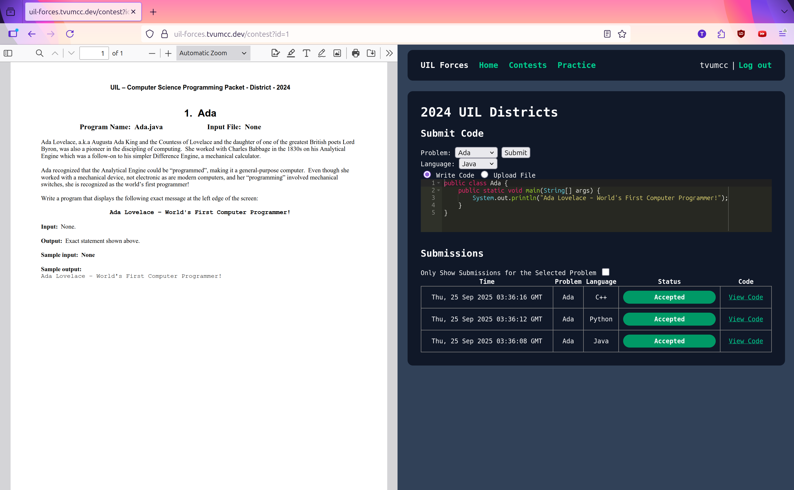

# UIL Forces

This is a contest manager and practice site made to help with practicing for Texas UIL Programming competitions and adjacent.

There is a PDF viewer to read problem statements, the option of an in-browser code editor or a file upload for submission, and the choice of Java, Python, or C++ as langagues.

NOTE: Still a work in progress. Most of the work done has been on the backend with the judging system, so currently the UI is pretty bare-bones.
