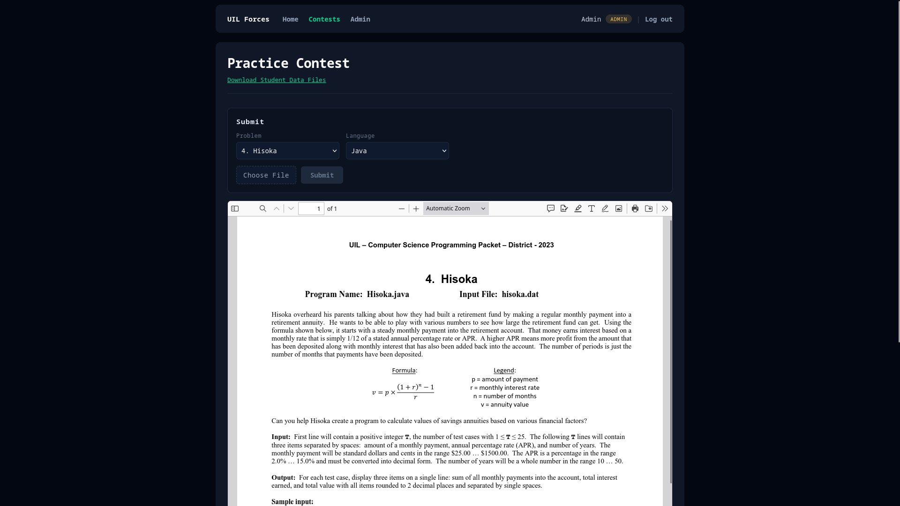

# UIL Forces


UIL Forces is a platform for running [UIL Computer Science](https://www.uiltexas.org/academics/stem/computer-science) programming contests. It consists of a server and a web client.

The main advantage of using UIL Forces over existing contest managers ([PC²](https://pc2ccs.github.io/), [Hackerrank](https://www.hackerrank.com/), [Codeforces](https://codeforces.com/)) is that it is built specifically for UIL Computer Science, matching its problem, contest, and scoring structure.

Some other features include:

- Automatic judge system supporting Java and Python code submissions. Grading runs either in sandboxed Docker containers for stronger isolation, or without Docker for school computers that lack administrator privileges to install it.
- Persistent contest history: all users, submissions, and scores are stored in a single database that persists across contests, so past results and submission history remain available long after a contest ends.
- Live contest leaderboard breaking down problems solved by each user
- PDF viewer that allows users to access problem statements. This can be disabled for individual contests.
- Adding problem sets en masse with a YAML file, data files, and PDFs



## Usage

See [OPERATIONS.md](OPERATIONS.md)

## Building

To build this project, you must have Python and npm installed.

First, build the frontend by running the following commands:

```bash
cd frontend
npm install
npm run build
```

Then build the backend:

```bash
# Setup virtual environment
cd backend
python -m venv .venv
.venv\Scripts\activate.bat # Windows Only
source .venv/bin/activate # MacOS & Linux Only
pip install -r requirements.txt
```

While still in the `backend` directory, the project can be run with `python main.py`, or it can be bundled into an executable:

```bash
pyinstaller main.spec --distpath pyinstaller-dist --workpath pyinstaller-build
```